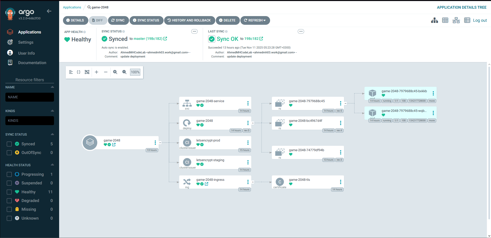

# EKS Deployment Project

A production-ready Kubernetes cluster on AWS EKS with complete automation, GitOps, monitoring, and security scanning.

## Overview

This project deploys a containerized 2048 game application on AWS EKS with:


- ✅ Fully automated infrastructure deployment (~15 minutes)
- ✅ GitOps with ArgoCD
- ✅ Automatic SSL certificates (Let's Encrypt)
- ✅ Automatic DNS management (External-DNS)
- ✅ Prometheus + Grafana monitoring
- ✅ Security scanning (Checkov + Trivy)
- ✅ IRSA for AWS authentication (no hardcoded credentials)

**Live Demo: likely down for cost purposes**
- Application: https://eks.ahmedmhcodelab.click
- ArgoCD: https://argocd.ahmedmhcodelab.click
- Grafana: https://grafana.ahmedmhcodelab.click
- Prometheus: https://prometheus.ahmedmhcodelab.click

## Architecture


**Infrastructure:**
- AWS EKS (Kubernetes 1.29)
- 2 worker nodes (t3.medium) across 2 availability zones
- VPC with public/private subnets
- Route53 DNS + ECR registry
- Terraform state in S3 + DynamoDB

**Platform Services:**
- NGINX Ingress Controller
- Cert-Manager (SSL certificates)
- External-DNS (Route53 automation)
- ArgoCD (GitOps)
- Prometheus + Grafana (monitoring)

## Quick Start

### Prerequisites
- AWS CLI v2
- Terraform >= 1.0
- kubectl >= 1.29
- Helm >= 3.0
- AWS account with Route53 hosted zone

### Setup

1. **Configure Terraform backend:**
   ```bash
   ./setup-backend.sh
   # Update Terraform/backend.tf with output values
   ```

2. **Set variables in `Terraform/terraform.tfvars`:**
   ```hcl
   project_name     = "EKSDeployment"
   aws_account_id   = "YOUR_ACCOUNT_ID"
   route53_zone_id  = "YOUR_HOSTED_ZONE_ID"
   ```

3. **Configure GitHub Secrets:**
   - `AWS_ACCESS_KEY_ID`
   - `AWS_SECRET_ACCESS_KEY`

4. **Deploy via GitHub Actions:**
   - Run "Setup Infrastructure" workflow
   - Input: `CREATE`
   - Wait ~15 minutes

5. **Access services:**
   - Credentials will be displayed in workflow output

## Project Structure

```
EKS-Deployment/
├── .github/workflows/    # CI/CD pipelines
├── Terraform/            # Infrastructure as Code
│   └── modules/          # VPC, EKS, ECR modules
├── helm-values/          # Helm chart configurations
├── k8s/                  # Kubernetes manifests
├── argocd-apps/          # ArgoCD applications
└── Dockerfile            # Application container
```

## GitOps Workflow

1. Push code to GitHub
2. GitHub Actions builds and scans Docker image
3. Image pushed to ECR with new tag
4. Kubernetes manifests updated
5. ArgoCD detects changes and syncs cluster
6. Rolling update applied to pods


*ArgoCD automatically syncs and deploys application changes*

## Cleanup

**Via GitHub Actions (recommended):**
```
Run "Cleanup" workflow → Input: DESTROY → Wait ~10 minutes
```

**Manually:**
```bash
cd Terraform
terraform destroy -auto-approve
```

## Common Commands

```bash
# Cluster status
kubectl get nodes
kubectl get pods -A

# Get ArgoCD password
kubectl -n argocd get secret argocd-initial-admin-secret \
  -o jsonpath="{.data.password}" | base64 -d

# Get Grafana password
kubectl get secret -n monitoring prometheus-grafana \
  -o jsonpath="{.data.admin-password}" | base64 -d

# Check certificates
kubectl get certificate -A

# View logs
kubectl logs -f <pod-name> -n <namespace>
```

## Troubleshooting

- **Pods stuck pending:** Check node capacity with `kubectl describe node`
- **Certificates not issuing:** Verify cert-manager logs and DNS records
- **Ingress 503 errors:** Check service endpoints with `kubectl get endpoints`
- **Terraform destroy fails:** Manually delete load balancers first

## Documentation

For detailed documentation, see:
- [Detailed Documentation](brassy-coast-e1c.notion.site/Documentation-EKS-Project-2a1ae71e63408099b477f0d5c4ce3594?pvs=74)
## Built By

[Ahmed](https://github.com/AhmedMHCodeLab)